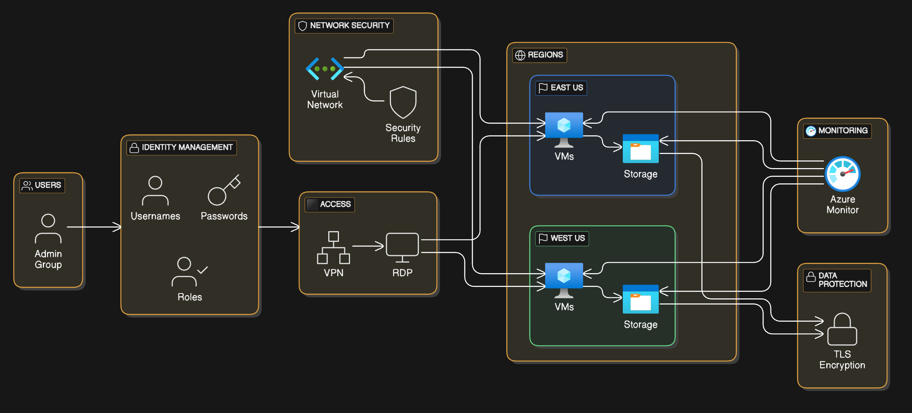

<h1>Azure Cloud Governance</h1>

1st March 2025

<h3>OVERVIEW</h3>

This project will be used to show knowledge of how to maintain Cloud governance in the Azure Cloud environment. The environment will follow both FedRAMP and HIPAA compliance. My own personal resources were used to develop the environment. Compliance is based on Confidentiality, Integrity, and Availability.

GOALS

1.	Continuous monitoring using Azure Monitor to collect log data

2.	Identity and access management through the use of user names, passwords, and roles

3.	Control network traffic using a virtual network and implementing security rules to manage inbound and outbound traffic

4.	Manage the availability of resources by creating them in different regions for redundancy

5.	Protecting PII/PHI with Data encryption on storage accounts

SPECIFICATIONS

The Azure VMs are implemented in both the east-us and west-us availability zones. Access to the VMs is only allowed for users within the administrative user group. VM is only accessible through RDP on the VPN. The storage account is encrypted with TLS.

